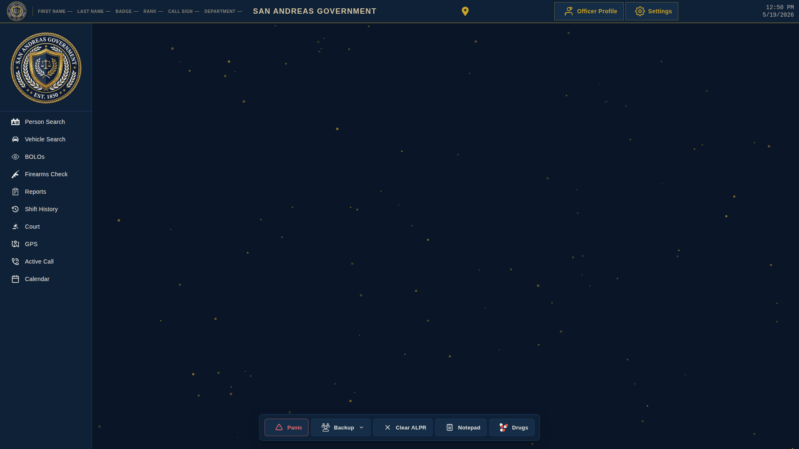

# MDT Pro

A Police Computer Plugin for LSPDFR. MDT Pro runs a local web server when you go on duty, so you can use the MDT (Mobile Data Terminal) from any browser—on the same machine or over your network.



## Requirements

- **LSPDFR**
- **CommonDataFramework (CDF)** — required; the plugin will not load without it.
- **CalloutInterfaceAPI** — required (DLL in game root or `plugins/LSPDFR/`).
- **CalloutInterface** — required; the *Active Call* page uses it for live callout details (location, priority, messages). Integration is shallow but required.
- **Policing Redefined (PR)** — required. A large portion of MDT Pro (roughly half to three-quarters) relies on the PR API for ped/vehicle stops, arrests, and citations. If you don’t run PR, you need to install it or this mod is not for you.

## Building (for developers)

To build the plugin from source:

1. **Restore packages**  
   From repo root:  
   `dotnet restore MDTProPlugin\MDTPro.sln`  
   (Or open the solution in Visual Studio; it restores automatically.)

2. **Reference DLLs from game**  
   Create a `References` folder in the repo root and copy these from your GTA V install:
   - `plugins/LSPDFR/CalloutInterface.dll`
   - `plugins/LSPDFR/CalloutInterfaceAPI.dll` (or from game root)
   - `plugins/LSPDFR/PolicingRedefined.dll`
   - `plugins/LSPDFR/LSPD First Response.dll` (from `plugins/`)
   - `IPT.Common.dll` (game root)

   Other dependencies (CommonDataFramework, Newtonsoft.Json, System.Data.SQLite, etc.) come from NuGet. `References` is in `.gitignore` (each dev uses their own game copy).

3. **Build**  
   From repo root:  
   `dotnet build MDTProPlugin\MDTPro.sln -c Release`  
   Or open `MDTProPlugin\MDTPro.sln` in Visual Studio and build **Release**.  
   Output is in `Release\plugins\lspdfr\MDTPro.dll` and `Release\MDTPro\` (web UI is copied automatically).

   Optional: run `.\build.ps1` for a clean build; use `.\build.ps1 -Deploy` to build and copy into your GTA V folder (pass `-GamePath "D:\Games\GTA V"` if your install is elsewhere).

## Installation

1. Extract all files and folders from the ZIP into the GTA V main directory (the folder containing `GTA5.exe`).

Your GTA V folder should have:
- `plugins/LSPDFR/MDTPro.dll`
- `System.Data.SQLite.dll` (in the GTA V root, same folder as `GTA5.exe`)
- `x64/SQLite.Interop.dll` (in the `x64` folder inside the GTA V root)
- `MDTPro/` folder (web UI)

**SQLite placement:** The native loader looks in the application directory (GTA V root), not in `plugins/LSPDFR`. If you see "Could not load file or assembly 'System.Data.SQLite'" or `DllNotFoundException`, ensure both SQLite files are in the root (and `x64\` for the Interop).

## Updating

- Overwrite the plugin files with the new version (replace the contents of `plugins/LSPDFR/` and the `MDTPro` folder with the updated files, or merge so that new files are added and existing ones updated). Your existing `MDTPro/data/` and `MDTPro/config.json` are preserved if you don’t delete them.
- **Config:** Existing installs keep the values already in `MDTPro/config.json`. To use a **new default** (e.g. a lower-CPU WebSocket update rate), either:
  - Open the MDT in your browser → **Settings** (gear) → **Customization** → **Config** tab, change the setting (e.g. `webSocketUpdateInterval` to `1000`), then **Save**, or
  - Edit `MDTPro/config.json` in a text editor and set the value (e.g. `"webSocketUpdateInterval": 1000`), then save the file.
- No need to wipe data or config unless you want a full reset (see [Resetting data](#resetting-data-optional)).

## Setup

- Go on duty with LSPDFR. MDT Pro will start its web server and show in-game notifications with the addresses to open the MDT.
- If you miss the notifications, addresses are also written to `MDTPro/ipAddresses.txt`.
- Open the MDT in any browser. Chromium-based browsers (e.g. Chrome, Brave) work best. Use one of the shown addresses—if one fails (e.g. firewall), try another.
- The default port is **8080**. You can change it (and other options) on the **Customization** page (see [Customization](#customization)).

### Setup using Steam overlay

- In Steam: **Steam → Settings → In-Game**.
- Enable *Enable the Steam Overlay while in-game*.
- Set *Overlay shortcut key(s)* to the key you want for opening the overlay (and thus the MDT).
- Set *Web browser home page* to `http://127.0.0.1:8080` (or the address and port shown by MDT Pro).

## UI Usage

### Desktop and Control Panel

- The **taskbar** shows the badge, current location, a **Settings** (gear) button, and the clock. Click **Settings** to open the **Control Panel**.
- In the Control Panel you can:
  - Enter and save **Officer Information** (name, badge number, rank, call sign, department). Use *Fill from Game* to pull your character details from the game when supported.
  - **Start** or **End** your current shift.
  - View **Career Statistics** (totals from completed shifts and reports).
- The **Customization** link in the Control Panel opens the config and plugins page in a new tab.

### Reports

- All reports include **general**, **officer**, and **location** sections. These are auto-filled from your officer info and current location but can be edited.
- The **report ID** is generated automatically and cannot be changed.
- Use the **status** filter in the reports list (e.g. active, completed, canceled). Canceled reports are treated as deleted but remain viewable.
- Reports created **while a shift is active** (after you have clicked *Start Shift* in the Control Panel) are **attached to that shift** and appear in Shift History.
- A **notes** section is available for incident description or extra details.
- Report drafts are auto-saved in the browser; if you leave and return to the create page within 24 hours, you may be prompted to restore the draft.

#### Incident reports

- Use for any reporting that does not fit citations or arrests.
- Offender, witness, and victim names are optional.

#### Citation and arrest reports

- The **charges** you add are stored with the report and, if an offender is set, are added to that person’s record for future lookups.
- With **PolicingRedefined** installed, citations can be **issued to offenders from the ped menu** in-game; the MDT is used to create and manage the citation reports.

### Person Lookup (Ped Search)

- Search by name to see information about that person (from MDT Pro and, when available, CDF).
- The **history** section lists citations and arrests. Click a citation or arrest entry to **create a new report** for that ped (pre-filled where applicable).
- **Callout suspects:** Person records normally come from CDF (e.g. peds you stop, vehicle owners). Some callout packs generate a suspect name from evidence (e.g. “mobile phone associated with Joe Thomas”) but do *not* register that person with CDF, so they would not appear in Person Search. MDT Pro tries to add name-only “stub” records when it sees phrases like “associated with …”, “sightings of …”, etc. in the **Active Call** message or additional messages. You can turn this off in config with `addCalloutSuspectNamesFromMessages: false`. For full integration, callout authors can register suspects with CDF so they appear across all CDF-using plugins.

### Vehicle Lookup

- Search by **license plate** or **VIN** to see vehicle and related information.
- Click the **owner** in the basic information area to open Person Lookup for the vehicle’s registered owner.

### Shift History

- View all past shifts and the **reports linked to each shift** (reports created while that shift was active).

### Court

- View and manage **court cases** derived from citation and arrest reports.
- Filter and sort by status, case number, ped name, or report ID.
- Cases can be updated (e.g. status, resolution); the system supports docket management, sentencing, and related options configurable in `config.json`.

### Map (GPS)

- Shows your **current position** on a map (updated via WebSocket while the game is running).
- **Route** from your position to a chosen point; turn-by-turn instructions and map display are provided. Uses in-game road data and configurable routing options.

### Active Call

- Shows details of the **current callout** when **CalloutInterface** is installed: location (postal, street, area, county), priority, message, advisory, unit/callsign, and timestamps (displayed, accepted, finished).
- Without CalloutInterface, the page opens but does not receive callout data.
- When callout messages mention a suspect by name (e.g. “associated with Joe Thomas”), MDT Pro can add that name to Person Search so you can look them up; see [Person Lookup](#person-lookup-ped-search).

## Customization

The **Customization** page (linked from the Control Panel, or open `/page/customization` in a new tab) lets you:

- **Change configuration** — e.g. HTTP port, in-game time vs real time, taskbar clock, window size, map options, court and evidence weights, and more. Settings are stored in `MDTPro/config.json`.
- **Manage plugins** — enable or disable MDT Pro plugins (see [Plugins](#plugins)).

### ALPR (Automatic License Plate Recognition)

- ALPR is an **optional** in-game feature. Enable it in **Customization** (config) or via the **in-game Settings menu** (default key **F7**; set in `MDTPro/MDTPro.ini`).
- When enabled and you are **on duty** and in a **police vehicle**, the game scans nearby vehicles and flags plates (e.g. stolen, expired registration/insurance, owner wanted). Flagged hits can show an in-game HUD panel and optional sound or notification.
- **Where flags come from:** Stolen/expired/wanted are read only from **CDF** and the **MDT database** (vehicles you’ve run or marked in the MDT). If you rarely see any hits, vehicles may be outside the read range—increase `alprReadRangeMeters` in `config.json` (e.g. 18–22).
- The **ALPR plugin** (in `MDTPro/plugins/ALPR/`) adds **popups in the MDT** when the in-game scanner gets a hit, so you can see details in the browser. Enable the plugin on the Customization page.

## Plugins

Plugins extend MDT Pro by injecting JavaScript and CSS and optionally adding new pages.

### Using a plugin

- Place the plugin folder inside `MDTPro/plugins`.
- Enable the plugin on the **Customization** page.

### Creating a plugin

#### Plugin folder structure

```
Plugin Name
    │   info.json
    │
    ├───pages
    │       page.html
    │
    ├───scripts
    │       script 1.js
    │       script 2.js
    │
    └───styles
            style 1.css
            style 2.css
```

Multiple pages, scripts, and styles are supported per plugin.

- HTML in `pages` is served at `/plugin/<pluginId>/page/<fileName>`
- JS in `scripts` is served at `/plugin/<pluginId>/script/<fileName>`
- CSS in `styles` is served at `/plugin/<pluginId>/style/<fileName>`
- In JavaScript, get the plugin ID with: `const pluginId = document.currentScript.dataset.pluginId`
- Scripts and styles are loaded on the main index page when the plugin is enabled on the Customization page.

#### info.json example

```json
{
  "name": "Plugin Name",
  "description": "An MDT Pro plugin",
  "author": "Your Name",
  "version": "2.0.1"
}
```

#### Plugin API

Use the functions in `MDTPro/main/scripts/pluginAPI.js`. Open that file in an editor for IntelliSense. All API functions are on the `API` object.

#### Example: add a new page

```js
const pageSVG =
  '<svg xmlns="http://www.w3.org/2000/svg" xmlns:xlink="http://www.w3.org/1999/xlink" viewBox="0 0 1 1" xml:space="preserve"><!-- valid SVG --></svg>'

API.createNewPage('test', 'Test Page', pageSVG, initTestPage) // requires test.html in pages folder

function initTestPage(contentWindow) {
  contentWindow.document.body.innerHTML = 'Test page loaded'
}
```

## Resetting data (optional)

The **ClearMDTProData** utility (in the repo, in the `ClearMDTProData` folder) can reset the SQLite database, legacy shift/court/peds JSON, etc. Build it first (e.g. open `ClearMDTProData/ClearMDTProData.sln` and build, or run `dotnet run` from the `ClearMDTProData` folder). Then run the executable from the directory that contains the `MDTPro` folder (e.g. GTA V main directory after install, or repo root when using the repo’s `MDTPro`). Use when you want a clean slate without deleting the whole `MDTPro` folder.

## License

MDT Pro is licensed under the [Eclipse Public License - v 2.0](LICENSE).

The following files/folders are excluded and licensed under the [MIT License](MIT%20LICENSE): `MDTPro/arrestOptions.json`, `MDTPro/citationOptions.json`, `MDTPro/language.json`, `MDTPro/config.json`
